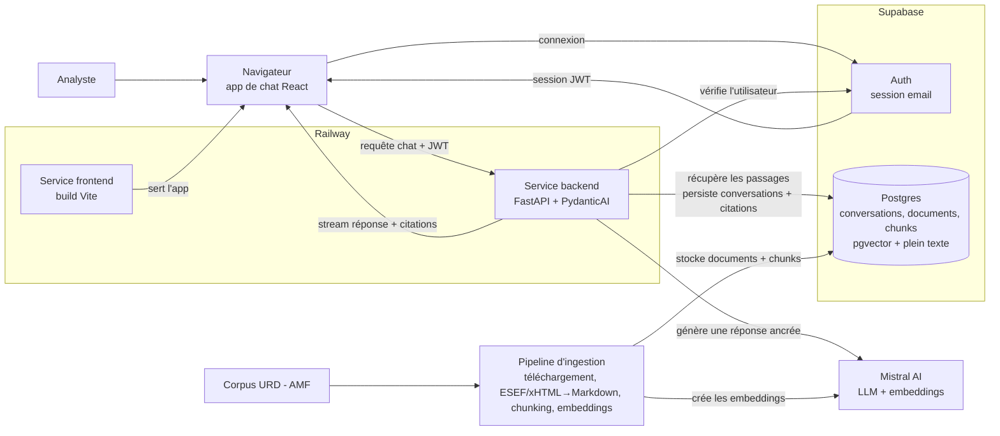

# Architecture d'Assistant Financier

## Objet

Assistant Financier est un assistant de recherche interne pour les analystes qui ont besoin de réponses ancrées à partir d'un corpus curé de documents réglementés de sociétés françaises (URD du CAC 40). L'architecture doit optimiser la confiance : chaque réponse est générée à partir de passages sources récupérés, chaque affirmation factuelle est citable, et le système échoue clairement quand le corpus ne permet pas de répondre.

Ce document décrit l'architecture cible de l'expérience de chat, de l'orchestration LLM, et de la couche de communication entre la SPA React, Supabase et le backend FastAPI.

## Architecture de haut niveau

Le meilleur diagramme d'ouverture est une vue au niveau service qui montre les deux chemins principaux : le chemin de chat en direct qui sert les utilisateurs, et le chemin d'ingestion qui prépare les URD pour la recherche.



## Objectifs d'architecture

- Garder le navigateur léger : il affiche l'état du chat, gère la session Supabase de l'utilisateur, et stream les réponses de l'assistant.
- Garder le backend autoritaire : recherche, ancrage, vérification des citations, exécution d'outils et écritures en base se font dans FastAPI.
- Utiliser Supabase pour l'identité et l'état produit durable : utilisateurs, fils de conversation, documents sources, chunks, embeddings et métadonnées de citation.
- Utiliser le `pgvector` de Supabase pour la recherche sémantique et la recherche plein texte Postgres (configuration `french`) pour la recherche par mots-clés.
- Rendre le chemin LLM typé et testable en utilisant des agents PydanticAI avec dépendances, sorties et frontières d'outils explicites.
- Préserver un modèle de déploiement simple sur Railway : un service frontend, un service backend sans état, et Supabase hébergé.

## Stack

Frontend :

- Vite + React SPA + TypeScript
- React Router pour le routage
- Tailwind CSS et shadcn/ui pour l'UI
- `@supabase/supabase-js` pour l'auth navigateur
- Paquets UI du Vercel AI SDK pour l'état du chat et le comportement de streaming côté client

Backend :

- Python 3.12+
- FastAPI + Uvicorn
- Pydantic v2 + pydantic-settings
- PydanticAI pour l'orchestration LLM typée (avec le modèle Mistral)
- SDK Mistral pour la génération et les embeddings
- Client Python Supabase pour l'accès base côté serveur
- Modèles SQLAlchemy + migrations Alembic pour la gestion du schéma
- `pgvector` de Supabase pour la recherche sémantique
- Recherche plein texte Postgres (configuration `french`) pour la recherche lexicale
- Une bibliothèque d'extraction de texte pour transformer les URD en Markdown : surtout du **xHTML iXBRL** (format ESEF), et du **PDF** pour les rares anciens exercices
- `httpx` pour le HTTP sortant
- `structlog` pour les logs structurés

Persistance :

- Supabase Auth pour la connexion email
- Supabase Postgres pour les enregistrements utilisateurs, fils de conversation, messages, documents sources, chunks, embeddings, vecteurs de recherche plein texte et métadonnées de citation

## Frontières du système

Le frontend est responsable de l'interaction utilisateur, de l'état UI local, et de l'envoi de la requête de l'utilisateur authentifié au backend. Il ne doit jamais détenir d'identifiants service-role, exécuter de logique de recherche, appeler Mistral directement, ni écrire d'enregistrements privilégiés dans Supabase.

Le backend est responsable de l'autorisation des requêtes, de la recherche, de la construction du prompt, de l'exécution du LLM, de la validation des citations, du streaming des réponses et de la persistance durable. Il détient tous les identifiants privilégiés et est le seul service autorisé à utiliser la clé service-role Supabase.

Supabase est responsable de l'authentification et de l'état produit durable. L'accès navigateur utilise la clé anon et le JWT utilisateur. L'accès serveur utilise soit le bearer token de l'utilisateur pour les opérations à portée utilisateur, soit la clé service-role pour les écritures privilégiées qui doivent rester explicitement liées à l'utilisateur authentifié.

## Flux de requête

1. L'utilisateur se connecte avec l'auth email Supabase dans la SPA React.
2. Le frontend stocke la session Supabase via `@supabase/supabase-js`.
3. Quand l'utilisateur ouvre une conversation, le frontend charge le fil et les messages précédents via FastAPI, qui lit les enregistrements à portée utilisateur depuis Supabase.
4. L'UI de chat utilise les primitives React du Vercel AI SDK pour gérer l'état des messages et soumettre les nouveaux messages au point d'entrée chat de FastAPI.
5. Le frontend envoie le token d'accès Supabase comme `Authorization: Bearer <token>`.
6. FastAPI vérifie le token auprès de Supabase Auth avant toute recherche ou travail LLM.
7. FastAPI crée un contexte à portée requête contenant l'utilisateur authentifié, le fil de conversation, le client Supabase, le service de recherche, la politique de citation et les paramètres LLM.
8. Un agent PydanticAI récupère les chunks de documents pertinents, génère une réponse ancrée, et renvoie une sortie typée contenant le texte de la réponse et les citations.
9. FastAPI stream les parties du message assistant vers le navigateur dans le format attendu par le client AI SDK.
10. FastAPI persiste le message utilisateur final, le message assistant, les chunks cités et les métadonnées d'usage dans Supabase.

## Couche de chat frontend

Le frontend reste une SPA Vite simple. Il ne doit pas adopter les route handlers Next.js ni les server components. Le AI SDK n'est utilisé que pour ses primitives React de chat et son comportement de streaming côté client.

Le module de chat doit être organisé autour de ces responsabilités :

- `src/lib/env.ts` valide `VITE_API_BASE_URL`, `VITE_SUPABASE_URL` et `VITE_SUPABASE_ANON_KEY`.
- `src/lib/supabase.ts` crée le client Supabase navigateur.
- `src/lib/http.ts` enveloppe `fetch`, applique l'URL de base du backend, injecte le bearer token Supabase, gère les timeouts, et convertit les échecs en erreurs d'API typées.
- `src/lib/api.ts` expose les appels produit comme charger les fils, créer des fils et récupérer l'historique des messages.
- `src/pages/chat/*` affiche les routes de chat et délègue le streaming à un composant de chat ciblé.
- `src/components/chat/*` affiche les messages, citations, passages sources, états vides et statut de streaming.

Le composant de chat doit s'initialiser avec les messages stockés puis laisser le AI SDK gérer l'état UI en cours. Le transport pointe vers FastAPI, pas vers une route serveur frontend.

Forme conceptuelle :

```ts
const { messages, sendMessage, status, error } = useChat({
  id: threadId,
  messages: initialMessages,
  transport: new DefaultChatTransport({
    api: `${apiBaseUrl}/chat/stream`,
    headers: async () => ({
      Authorization: `Bearer ${await getAccessToken()}`,
    }),
  }),
});
```

La surface d'API exacte doit être vérifiée à l'implémentation contre la version installée du AI SDK. La règle d'architecture est stable : le navigateur stream vers FastAPI avec le token Supabase de l'utilisateur, et FastAPI détient l'exécution de l'assistant.

## Couche LLM backend

PydanticAI doit être introduit comme couche d'orchestration du backend pour la génération de réponses. Il remplace les appels de prompt ad hoc par une frontière d'agent typée. Le modèle sous-jacent est Mistral, configuré via le provider Mistral de PydanticAI.

Modules backend recommandés :

```text
backend/app/
├── api/
│   └── chat.py                 # routes FastAPI pour les fils de conversation et le streaming
├── auth/
│   └── dependencies.py         # vérification JWT Supabase et dépendance current user
├── chat/
│   ├── orchestrator.py         # coordonne un tour de chat de bout en bout
│   ├── messages.py             # convertit les messages AI SDK vers/depuis les types internes
│   └── streaming.py            # émet les événements de streaming compatibles AI SDK
├── assistant/
│   ├── agent.py                # définition de l'agent PydanticAI
│   ├── deps.py                 # dataclass de dépendances runtime de l'agent
│   ├── outputs.py              # GroundedAnswer, Citation et SourcePassage
│   └── instructions.md         # instructions système et contrat produit
├── retrieval/
│   ├── queries.py              # requêtes SQL pgvector et plein texte
│   ├── fusion.py               # Reciprocal Rank Fusion pour la recherche hybride
│   └── retriever.py            # logique de récupération requête → passages sources
├── grounding/
│   └── validator.py            # garantit que les citations correspondent aux passages récupérés
└── database/
    ├── supabase.py             # construction du client Supabase
    ├── models.py               # modèles de tables SQLAlchemy pour l'autogenerate Alembic
    ├── chats.py                # persistance conversations, fils, messages et citations
    └── documents.py            # requêtes documents sources, chunks, embeddings et recherche
```

Ces noms doivent suivre le workflow produit plutôt qu'une couche de service générique. `chat/orchestrator.py` détient tout le cycle de vie du tour, `assistant/agent.py` détient la frontière LLM, `retrieval/` détient la recherche hybride des passages sources, et `grounding/` détient le contrat de confiance selon lequel les réponses doivent citer les preuves récupérées.

L'agent doit recevoir des dépendances explicites plutôt que d'aller chercher dans des globales :

```python
@dataclass
class DocumentAgentDeps:
    user_id: str
    thread_id: str
    retriever: DocumentRetriever
    grounding_validator: GroundingValidator


class GroundedAnswer(BaseModel):
    answer: str
    citations: list[Citation]
    cited_passages: list[SourcePassage]
```

Les instructions de l'agent doivent encoder le contrat produit :

- Répondre uniquement à partir des passages récupérés.
- Citer chaque affirmation factuelle.
- Si le contexte récupéré est insuffisant, dire que le corpus ne contient pas assez de preuves.
- Ne pas fournir de recommandations boursières ni de conseil en investissement.
- Garder des réponses assez concises pour la relecture par un analyste, mais inclure assez de passages cités pour vérifier la réponse.
- Répondre en français.

La recherche et l'ancrage restent indépendants de PydanticAI. Cela garde l'ingestion, les tests de recherche et la validation des citations testables sans invoquer le LLM.

## Stratégie de recherche

Assistant Financier utilise une recherche hybride :

1. Embedder la requête de l'utilisateur avec le modèle d'embedding Mistral configuré (`mistral-embed`, 1024 dimensions).
2. Lancer une recherche sémantique sur `document_chunks.embedding` avec `pgvector`.
3. Lancer une recherche lexicale sur `document_chunks.search_vector` avec la recherche plein texte Postgres (configuration `french`).
4. Fusionner les deux listes classées en Python avec le Reciprocal Rank Fusion.
5. Récupérer les chunks sélectionnés, les métadonnées du document source et les chunks voisins optionnels pour l'ancrage.

Cela garde la base responsable d'une récupération classée efficace et garde l'application responsable de la politique de classement spécifique au produit. La première implémentation doit éviter le SQL généré par l'agent ; l'agent PydanticAI reçoit des outils bornés comme `search_filings`, `read_chunk` et `read_surrounding_chunks`.

## Communication Supabase et FastAPI

Supabase Auth est la source d'identité. FastAPI doit traiter le JWT Supabase du navigateur comme l'identifiant de la requête.

Règles frontend :

- N'utiliser la clé anon que dans le navigateur.
- Lire la session courante via le client Supabase partagé.
- Envoyer le token d'accès à FastAPI via le client d'API partagé.
- Ne jamais faire transiter de tokens via les props des composants.
- Ne jamais exposer la clé service-role au frontend.

Règles backend :

- Vérifier `Authorization: Bearer <token>` à la frontière FastAPI.
- Rejeter les requêtes non authentifiées avant toute recherche ou travail LLM.
- Dériver `user_id` et l'email depuis l'utilisateur Supabase vérifié.
- Utiliser des opérations base à portée utilisateur partout où c'est possible.
- N'utiliser la clé service-role que côté backend pour les écritures privilégiées impossibles à faire sûrement avec la clé anon.
- Toujours rattacher les enregistrements de conversation persistés au `user_id` authentifié.

Le backend peut vérifier le JWT en appelant le endpoint user de Supabase Auth, ou en validant les clés de signature JWT du projet. Pour la première implémentation, appeler Supabase Auth est plus simple et évite les erreurs de validation JWT locale. Si le volume de requêtes croît, la vérification JWT locale peut être ajoutée derrière la même interface `AuthService`.

Unités backend recommandées :

- `app/auth/dependencies.py` valide les bearer tokens et expose `get_current_user`.
- `app/database/supabase.py` crée les clients Supabase à portée utilisateur et admin.
- `app/database/chats.py` stocke et lit les fils, messages et enregistrements de citation.
- `app/database/documents.py` stocke et lit les documents sources, chunks, embeddings et données de recherche plein texte.

## Contrat de streaming

Le frontend doit recevoir une sortie assistant incrémentale, pas attendre une réponse complète. FastAPI doit exposer un point d'entrée de streaming qui émet des parties de message compatibles AI SDK.

Point d'entrée recommandé :

```text
POST /chat/stream
Authorization: Bearer <token_acces_supabase>
Content-Type: application/json
```

Corps de requête :

```json
{
  "threadId": "uuid",
  "messages": []
}
```

La charge `messages` doit utiliser le format de message UI du AI SDK à la frontière frontend. FastAPI peut traduire ce format filaire en modèles Pydantic internes avant d'invoquer l'agent.

Responsabilités de streaming :

- Envoyer les deltas de texte au fur et à mesure de la génération de la réponse.
- Envoyer les métadonnées de citation/source en parties structurées dès qu'elles sont disponibles.
- Envoyer des événements d'erreur clairs pour les échecs d'authentification, fils manquants, échecs de recherche et échecs d'ancrage.
- Ne persister qu'après la fin réussie de l'exécution de l'assistant, sauf si un modèle de message partiel distinct est délibérément introduit plus tard.

## Modèle de données

Les tables Supabase doivent être petites et orientées produit :

- `profiles` : une ligne par utilisateur authentifié, clé par `auth.users.id` de Supabase.
- `chat_threads` : métadonnées de fil, propriétaire, titre, horodatages.
- `chat_messages` : messages utilisateur et assistant dans l'ordre, avec JSON de message compatible AI SDK quand utile.
- `message_citations` : enregistrements de citation normalisés liés aux messages assistant.
- `source_documents` : enregistrements de documents originaux avec métadonnées de dépôt, URL source et contenu Markdown normalisé.
- `document_chunks` : texte du chunk, métadonnées de chunk, embeddings et vecteurs de recherche plein texte générés.

`source_documents` stocke la version Markdown normalisée de chaque URD afin que l'application puisse re-chunker, inspecter et citer le texte extrait original sans retourner aux fichiers sources téléchargés (xHTML ESEF ou PDF). `document_chunks` stocke des passages prêts pour la recherche :

- ID de chunk
- ID de document
- index de chunk
- métadonnées de page ou de section
- texte du chunk
- vecteur d'embedding
- `tsvector` généré (configuration `french`) pour la recherche plein texte
- nombre de tokens
- métadonnées JSON : émetteur, société, ISIN, type de document, date de publication, exercice, page, section et offsets sources

La recherche hybride exécute deux requêtes bornées contre `document_chunks` : une requête sémantique `pgvector` et une requête plein texte Postgres. Le backend fusionne ces listes classées avec le Reciprocal Rank Fusion, puis récupère les chunks sélectionnés et le contexte voisin pour l'ancrage.

## Gestion du schéma

Les changements de schéma de base sont gérés depuis le backend avec des modèles SQLAlchemy et des migrations Alembic. Supabase est le Postgres hébergé, mais le dashboard Supabase n'est pas la source de vérité des définitions de tables.

Le workflow est :

1. Mettre à jour les modèles SQLAlchemy dans `app/database/models.py`.
2. Générer une migration candidate avec `uv run alembic revision --autogenerate -m "<changement>"`.
3. Relire le fichier de migration généré dans `backend/alembic/versions/`.
4. Ajouter les opérations de migration explicites pour les fonctionnalités Postgres/Supabase que l'autogenerate ne peut pas inférer de façon fiable.
5. Appliquer la migration localement ou contre la base Supabase liée avec `uv run alembic upgrade head`.
6. Commiter à la fois les changements de modèle et le fichier de migration.

Les tables normales et les index ordinaires doivent être représentés dans les modèles SQLAlchemy quand c'est praticable. Les éléments suivants doivent être écrits explicitement dans les migrations avec `op.execute()` ou des opérations Alembic soigneusement relues :

- `create extension if not exists vector`
- colonnes d'embedding `vector(1024)` si le rendu de type SQLAlchemy est insuffisant
- colonnes `tsvector` générées (configuration `french`)
- index HNSW pour la recherche vectorielle
- index GIN pour la recherche plein texte et les métadonnées JSON
- activation RLS et politiques
- grants ou permissions de rôle spécifiques à Supabase

Alembic doit se connecter avec la chaîne de connexion base directe/session de Supabase. Ne lance pas les migrations via l'URL du transaction pooler, car les migrations de schéma, la mise en place d'extensions et la création d'index exigent un comportement base au niveau session.

## Politique d'ancrage et de citation

L'ancrage fait partie de l'architecture, pas d'une préférence de prompt.

Le backend doit faire respecter ces invariants :

- Chaque réponse assistant a au moins une citation, sauf si la réponse dit explicitement qu'il n'y a pas assez de preuves.
- Chaque citation correspond à un passage source récupéré.
- Les passages cités incluent assez de métadonnées pour que le frontend affiche société, document, date, page ou section, et extrait.
- Le modèle ne peut pas citer de documents qui n'ont pas été récupérés pour la requête courante.
- Si la validation des citations échoue, le backend renvoie un échec contrôlé plutôt qu'une réponse non étayée mais soignée.

Cette politique doit être couverte par des tests unitaires backend autour de la recherche, de l'extraction de citations et de l'application de l'ancrage.

## Gestion des erreurs

Classes d'erreur attendues :

- `401 Unauthorized` : token Supabase manquant, expiré ou invalide.
- `403 Forbidden` : un utilisateur authentifié tente d'accéder au fil d'un autre utilisateur.
- `404 Not Found` : fil ou document source inexistant.
- `422 Unprocessable Entity` : charge de requête invalide.
- `502 Bad Gateway` : échec en amont du LLM ou de Supabase.
- `500 Internal Server Error` : échec backend inattendu.

Le frontend doit afficher des messages clairs tout en conservant assez de détail technique dans les logs pour le débogage. Les échecs réseau et CORS doivent être distinguables des échecs HTTP dans le client d'API partagé.

## Configuration

Chaque service doit garder un module de config unique comme source de vérité.

Paramètres frontend :

- `VITE_API_BASE_URL`
- `VITE_SUPABASE_URL`
- `VITE_SUPABASE_ANON_KEY`

Paramètres backend :

- `SUPABASE_URL`
- `SUPABASE_ANON_KEY`
- `SUPABASE_SERVICE_ROLE_KEY`
- `DATABASE_URL` pour Alembic et l'accès Postgres direct
- `MISTRAL_API_KEY`
- `MISTRAL_MODEL`
- `ALLOWED_ORIGINS`
- nom et dimensions du modèle d'embedding (`mistral-embed`, 1024)

Ne lis pas les variables d'environnement directement depuis les composants, route handlers ou services. Le code frontend doit utiliser `src/lib/env.ts`. Le code backend doit utiliser `app/config.py`.

## Pipeline d'ingestion

L'ingestion est le chemin qui prépare les URD pour la recherche. Le flux AMF distribue ces URD au format **ESEF** : une archive ZIP contenant un gros fichier **xHTML iXBRL** (HTML avec données financières balisées en XBRL). Seuls de rares anciens exercices (≈2020) sont encore des **PDF**. L'ingestion doit donc gérer les deux entrées, le xHTML étant majoritaire.

Étapes :

1. **Télécharger** les URD depuis info-financiere.fr (AMF), regroupés par exercice (voir `data/`). `download.py` dézippe l'ESEF et extrait le rapport xHTML ; les rares anciens URD restent en PDF.
2. **Extraire** chaque source en Markdown normalisé, en préservant titres, sections et tableaux autant que possible — depuis le xHTML iXBRL, ou depuis le PDF pour les anciens exercices.
3. **Chunker** le Markdown en passages prêts pour la recherche, avec métadonnées (société, ISIN, exercice, section, offset source).
4. **Embedder** chaque chunk avec `mistral-embed`.
5. **Écrire** documents sources et chunks (texte, embedding, `tsvector` français) dans Supabase.

L'extraction est l'étape la plus susceptible de dégrader la qualité. Le xHTML iXBRL est structuré (un atout sur le PDF), mais volumineux et parfois bruité par le balisage XBRL ; le PDF garde ses écueils habituels (tableaux financiers, mise en page multi-colonnes). À noter : le xHTML iXBRL n'a **pas de pagination fixe**, donc les citations s'ancrent sur la **section** plutôt que sur un numéro de page. Les tests d'ingestion doivent couvrir le chunking et l'attachement des métadonnées ; la qualité d'extraction doit être vérifiée sur des URD réels des deux formats.

## Forme de déploiement

Railway doit faire tourner deux services :

- Frontend : build Vite statique servi comme application web.
- Backend : service FastAPI exécutant Uvicorn.

Supabase reste hébergé et stocke les données durables de recherche. Le backend Railway peut rester sans état car chunks, embeddings, vecteurs de recherche plein texte, conversations et citations vivent tous dans Supabase Postgres. Les fichiers d'URD bruts (xHTML ESEF ou PDF) restent des entrées d'ingestion locales gitignorées, sauf si un workflow ultérieur les stocke dans un object storage.

## Séquence d'implémentation

1. Scaffolder la SPA frontend et l'app FastAPI backend selon les conventions du dépôt.
2. Ajouter les modèles SQLAlchemy et la mise en place des migrations Alembic dans le backend.
3. Ajouter la migration Alembic initiale pour `pgvector`, document source, chunk, plein texte, conversations et tables de citation.
4. Ajouter l'auth Supabase dans le frontend et la vérification de token dans FastAPI.
5. Ajouter le client d'API frontend partagé avec injection automatique du bearer token.
6. Ajouter le point d'entrée de streaming du chat avec une réponse assistant bouchonnée.
7. Ajouter l'UI de chat AI SDK sur le frontend, pointée vers FastAPI.
8. Ajouter l'ingestion : extraction xHTML/PDF→Markdown, chunking, embeddings et écritures Supabase.
9. Ajouter la recherche sémantique avec `pgvector`.
10. Ajouter la recherche plein texte Postgres (configuration `french`) et la fusion RRF en Python.
11. Ajouter l'agent document PydanticAI (modèle Mistral) avec dépendances typées et sortie de réponse typée.
12. Ajouter la validation des citations et l'application de l'ancrage.
13. Ajouter l'UI finale pour les citations, passages sources, états vides et erreurs.

## Non-objectifs

- Pas de Next.js, SSR, server components, ni route handlers frontend.
- Pas d'appels Mistral directs depuis le navigateur.
- Pas de base vectorielle managée distincte en dehors de Supabase.
- Pas d'architecture multi-tenant.
- Pas de données externes de marché/actualités.
- Pas de recommandations de trading ni de sélections de titres générées.
